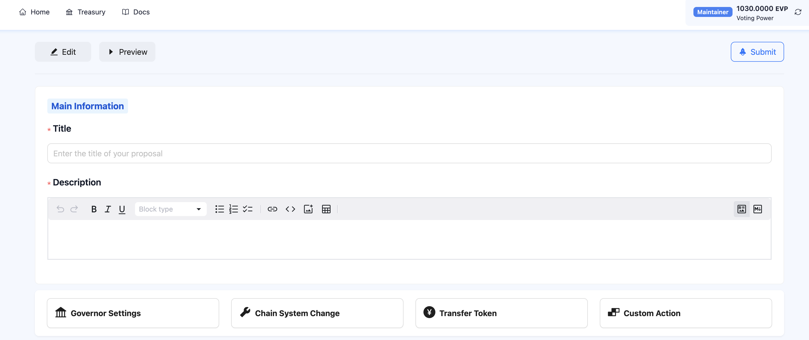
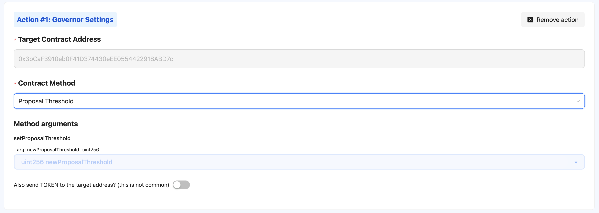
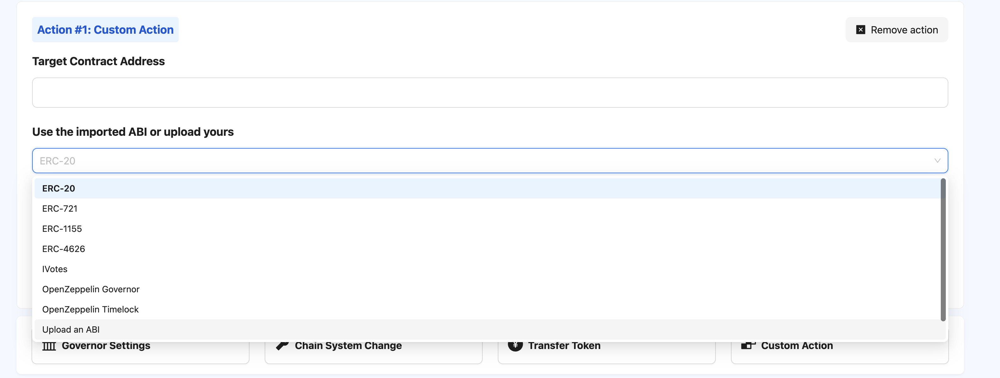

# BCOS-DAO 治理使用指南

## 1. 快速入门

### 1.1 什么是DAO？

DAO（去中心化自治组织）是一种由区块链技术支持的新型组织形式，具有以下特点：

- 去中心化：没有中心化的管理机构
- 透明：所有决策和资金流向公开可见
- 社区驱动：成员通过治理通证共同做出决策
- 自动执行：依靠智能合约实现规则和决策

### 1.2 为什么参与DAO治理很重要

- 直接民主：每个通证持有者都有发言权
- 影响项目发展：通过投票塑造组织未来
- 利益一致性：治理参与者与项目发展利益绑定
- 学习和成长：深入了解区块链生态系统

### 1.3 本应用功能概览

- 提案浏览与投票
- 创建新提案
- 委托投票
- 个人治理仪表板
- 钱包连接管理

## 2. 准备工作

### 2.1 账户准备

- 创建以太坊钱包
- 获取治理通证
- 钱包连接指南
  - MetaMask
  - WalletConnect
  - 其他支持的钱包

### 2.2 获取治理权限

- 如何获得治理通证
- 通证数量与投票权重的关系
- 委托机制说明

#### 2.2.1 治理通证要求

- 最低持有数量
- 持有时间限制
- 解锁治理权限条件

#### 2.2.2 委托机制

委托类型：

- 全部委托
- 部分委托
- 自我委托

委托优势：

- 提高参与度
- 集中投票影响力
- 降低个人参与成本

## 3. 提案浏览

### 3.1 提案列表

- 提案状态说明
- 筛选和排序提案
- 阅读提案详情

#### 3.1.1 提案状态

- 草稿：提案初始状态
- 讨论中：社区正在评估
- 投票中：可参与投票
- 已通过：达到通过条件
- 已拒绝：未达到通过门槛
- 已执行：提案生效

### 3.2 提案评估指南

- 如何理解提案内容
- 评估提案的关键点
- 社区讨论渠道

#### 3.2.1 阅读提案要点

- 提案目的
- 实施成本
- 预期影响
- 技术可行性

#### 3.2.2 评估关键点

- 对项目长期发展的影响
- 资金使用合理性
- 技术实现可能性
- 社区共识程度

#### 3.2.3 社区讨论渠道

- 官方论坛
- Discord
- Telegram
- GitHub讨论区

## 4. 投票流程

### 4.1 投票类型

- 支持(For)
- 反对(Against)
- 弃权(Abstain)

### 4.2 投票步骤

- 连接钱包
- 选择投票选项
- 确认交易
- gas费用说明

### 4.3 投票权重计算

- 通证数量对投票影响
- 委托投票机制

#### 4.3.1 通证数量影响

- 1个通证 = 1票权重
- 通证数量决定投票影响力

#### 4.3.2 委托投票机制

- 可将投票权委托给信任的社区成员
- 委托不转移通证所有权
- 可随时撤销委托

## 5. 创建提案

### 5.1 提案要求

- 提案准入条件
- 所需通证数量
- 提案格式规范

### 5.2 提案创建流程

#### 5.2.1 填写提案表单基本信息

在创建提案时，需要填写以下信息：

- 提案标题
- 提案描述
- 提案执行的动作

如下图所示，在Main Information中填写提案标题和描述：

其中，标题要求简洁明确，突出提案核心目的。描述部分使用Markdown格式，需要详细阐述提案的背景、目的、预期效果和实施步骤。

#### 5.2.2 填写提案执行动作

提案执行的动作包含四大类：

- Governor Settings：该类型的提案主要用于修改治理合约的设置，例如修改投票时间、投票权重等。
- Chain System Settings：该类型的提案主要用于修改链上系统的设置，例如修改区块大小、交易费用等。
- Transfer Token: 该类型的提案主要用于从DAO Treasury转移链上代币，例如转移治理代币、ERC20代币等。
- Custom Action: 该类型的提案主要用于执行自定义的智能合约操作，例如调用某个合约的函数等。可灵活配置。

如下图所示，在Action中选择提案执行的动作：

在选择提案执行的动作后，需要填写相应的参数，例如目标地址、转移金额等。具体参数要求根据所选动作类型而定。

**Governor Settins**

| 方法名                      | 作用                                                         | 影响范围                            |
| --------------------------- | ------------------------------------------------------------ | ----------------------------------- |
| Proposal Threshold          | 该方法将会更改DAO发起提案的Voting Power阈值，其数值单位是wei | 影响发起提案的权限                  |
| Vote Success Threshold      | 该方法将会更改DAO投票通过的权重阈值，其数值代表的是阈值分数的分子，值不应该大于100 | 影响提案投票的成功                  |
| Proposal Approval Threshold | 该方法将会更改审批Pending状态的提案时需要Maintainer同意的个数，其数值代表的是需要同意的个数 | 影响提案审批的流程                  |
| Quorum Numerator            | 该方法将更改提案投票时的Voting Power参与阈值，其数值代表的是阈值分数的分子，值不应该大于100 | 影响提案投票的成功                  |
| Voting Delay                | 该方法将更改提案在进入Queue状态之后可以执行需要等待的时间，其数值单位是秒，值不应该过大 | 影响提案可执行的时间                |
| Voting Period               | 该方法将更改提案在发起之后的可投票时间，超过了可投票时间提案将会失败，其单位数值是秒 | 影响提案的可投票时间                |
| Timelock                    | 该方法将更改提案的执行器Timelock的合约地址，更改后将切换新的Timelock合约 | 影响DAO整个系统                     |
| Voting Success Logic        | 该方法将更改VotingSuccessLogic的合约地址，该合约是用于判断投票是否成功的逻辑合约 | 影响提案投票的成功                  |
| Upgrade DAO Contract        | 该方法将升级DAO的整个合约                                    | 影响DAO整个系统                     |
| Change Timestamp Unit       | 该方法将更改DAO合约的Timestamp的时间戳单位                   | 影响DAO整个系统                     |
| Grant Maintainer            | 该方法将新增一个Maintainer角色                               | 影响DAO权限                         |
| Revoke Role                 | 该方法将撤销一个角色的权限                                   | 影响DAO权限                         |
| Mint EVP Token              | 该方法将补充发行EVP的数量，其数值单位是Wei                   | 影响EVP的数量，影响各个投票者的权重 |
| Burn EVP Token              | 该方法将销毁某个EOA账号EVP的数量，其数值单位是Wei            | 影响EVP的数量，影响各个投票者的权重 |
| Pause EVP Token             | 该方法将暂停EVP transfer功能的使用                           | 影响EVP的使用                       |
| Unpause EVP Token           | 该方法将恢复EVP transfer功能的使用                           | 影响EVP的使用                       |

**Chain System Change**

| 方法名                                         | 作用                                                         | 影响范围           |
| ---------------------------------------------- | ------------------------------------------------------------ | ------------------ |
| Change Chain System Config                     | 该方法将更改链的系统配置，将会更改区块链的运行逻辑，系统配置参考：[feature and bugfix list](https://fisco-bcos-doc.readthedocs.io/zh-cn/latest/docs/introduction/change_log/feature_bugfix_list.html) | 影响区块链的运行   |
| Change Consensus Config                        | 该方法将更改链上节点的身份配置，可以增加共识节点、将共识节点更改为观察节点、新增节点、更改共识节点权重 | 影响区块链的运行   |
| Remove Node                                    | 该方法将删除一个链上的节点身份                               | 影响区块链的运行   |
| Change ACL for Contract Deployment             | 该方法将更改目前的链上的部署权限的ACL类型，无权限控制填入0，白名单填入1，黑名单填入2 | 影响区块链的运行   |
| Change Deployment Permission of a Specific EOA | 该方法将更改某个账户的部署权限                               | 影响账户的部署权限 |
| Reset Admin of Specific Contract               | 更改某个合约的合约管理员                                     | 影响某个合约的使用 |

**Transfer Token**

将会从DAO Treasury transfer给某个账户

**Custom Action**

Custom Action要求发起提案者对合约的ABI编码、智能合约接口、calldata拼接有足够的理解，用户可灵活自行组装。

提供了一些常用合约的ABI模板，供Proposer使用。Proposer甚至可以自行上传ABI文件，用于ABI编码。

## 6. 高级治理功能

### 6.1 委托投票

- 如何将投票权委托给其他成员
- 部分/全部委托
- 取消委托

### 6.2 治理仪表板

- 个人投票历史
- 治理通证余额
- 影响力追踪

## 7. 常见问题

- 投票后能否更改
- 未参与投票的影响
- 提案通过的条件
- 安全注意事项

## 8. 最佳实践

- 积极参与
- 深入了解提案
- 理性讨论
- 保护私钥安全

## 9. 支持与反馈

- 社区沟通渠道
- 技术支持
- 问题报告