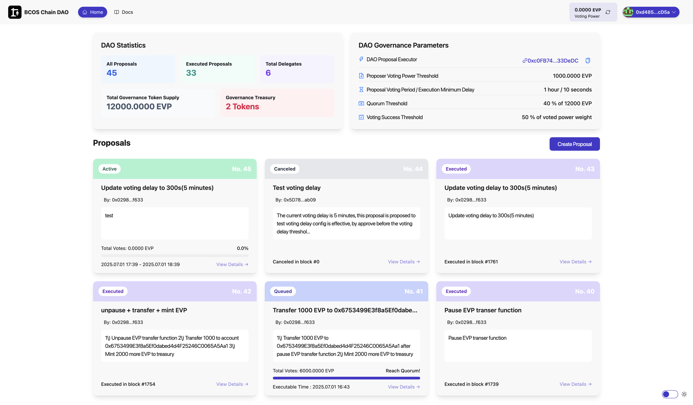
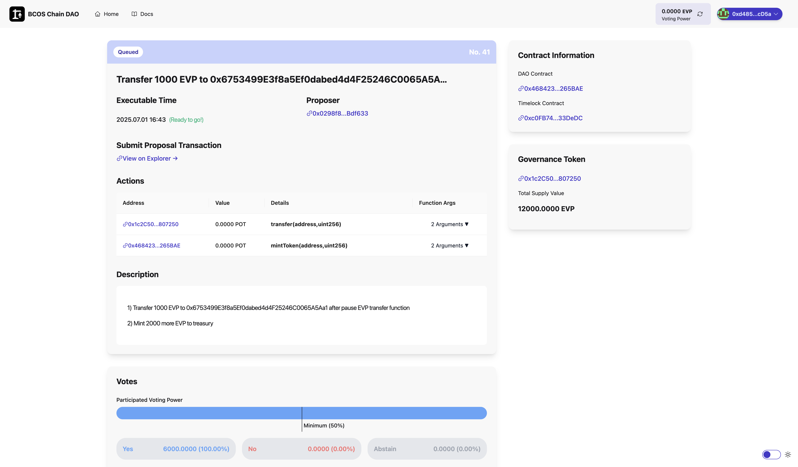
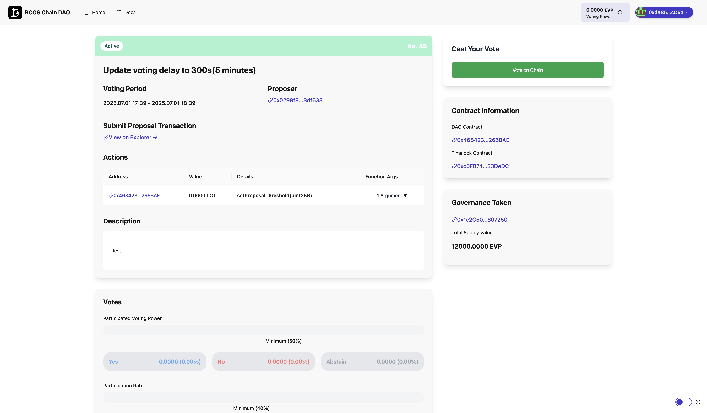
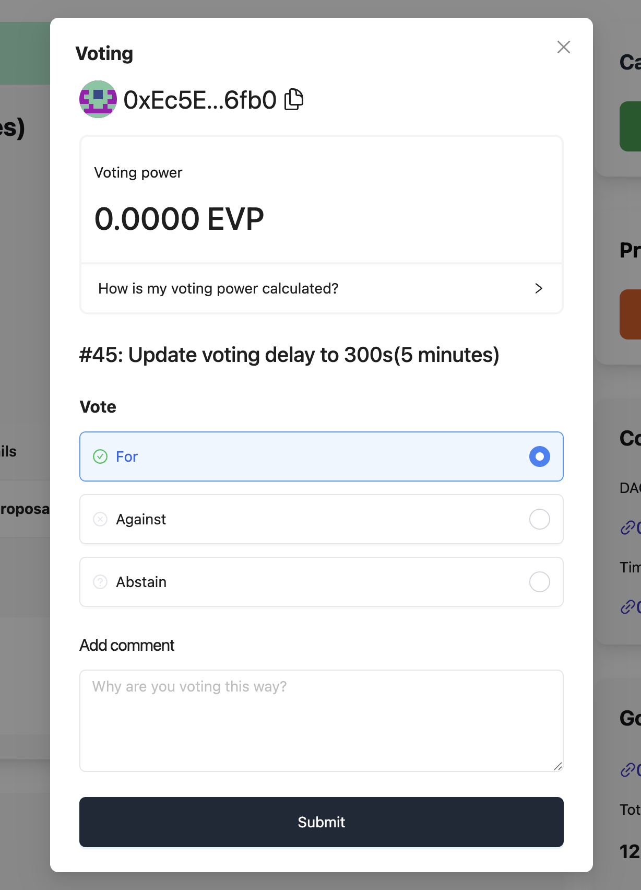

# BCOS-DAO 治理使用指南

BCOS DAO 是一个去中心化自治组织应用，允许用户通过创建提案、投票和执行决策来共同管理组织资源和规则。本文档将详细指导您如何使用 BCOS DAO 的各个功能，帮助您有效参与 DAO 治理过程。

## 1. 快速入门

### 1.1 什么是DAO？

DAO（去中心化自治组织）是一种由区块链技术支持的新型组织形式，具有以下特点：

- 去中心化：没有中心化的管理机构
- 透明：所有决策和资金流向公开可见
- 社区驱动：成员通过治理通证共同做出决策
- 自动执行：依靠智能合约实现规则和决策

### 1.2 为什么参与DAO治理很重要

DAO治理是区块链项目成功的关键因素之一，参与DAO治理有以下重要意义：

- 影响项目方向：每个成员的投票都能影响项目的发展和决策
- 保护自身权益：通过参与治理，确保自己的利益不受损害
- 增强社区凝聚力：积极参与治理可以增强社区成员之间的联系

### 1.3 DAO基本概念

- **去中心化自治组织 (DAO)**: 一种由代码定义的组织形式，通过智能合约自动执行决策，无需中心化管理
- **提案**: 对 DAO 进行更改的正式建议，需要通过投票批准
- **投票权**: 用户参与 DAO 决策的权重，由被委托的治理代币数量决定
- **治理代币 (EVP)**: 代表 DAO 中投票权的代币，被委托足够多的用户可以创建提案和参与投票

### 1.4 治理代币

治理代币是 DAO 中用于参与治理的核心资产，持有治理代币的用户可以创建提案、参与投票和行使其他治理权利。

#### 1.4.1 治理代币和投票之间的关系

治理代币是参与 DAO 投票的基础，持有治理代币的用户可以根据**被委托**的代币数量，参与投票。治理代币的数量直接影响用户的投票权重，持有更多代币的用户在投票时具有更大的影响力。

#### 1.4.2 治理代币的获取方式

目前治理代币（EVP）可以通过以下方式获取：

- **参与空投**: 在特定活动中，治理委员将会发起DAO提案，符合条件的用户可以获得治理代币空投
- **参与社区活动**: 通过参与社区讨论、测试和贡献代码等方式获得奖励

#### 1.4.3 治理代币的使用

治理代币的主要使用场景包括：

- **创建提案**: 持有一定数量的治理代币可以创建新的提案
- **委托投票**: 持有治理代币的用户可以将自己的投票权委托给其他成员，提高参与度和投票效率
- **参与社区治理**: 通过投票和提案，参与 DAO 的日常管理和决策

#### 1.4.4 治理代币的委托机制

治理代币的委托机制允许用户将自己的投票权委托给其他成员，从而提高参与度和投票效率。委托机制的主要特点包括：

- **灵活性**: 用户可以根据需要随时委托或撤销委托
- **信任基础**: 委托投票通常基于对被委托人的信任
- **透明性**: 委托关系在链上公开，任何人都可以查看

#### 1.4.5 治理代币权重的时效性

用户的投票权是根据在提案生效前委托给用户的代币数量来计算的。您可以将您的选票委托给自己，或者委托给其他人。其他人也可以将他们的选票委托给您。

对于来自您拥有的代币的选票，如果您在提案生效后才将其委托给自己，这些选票将不会计入您对此提案的投票权。这些选票将计入您对未来提案的投票权。

这种机制旨在防止用户通过购买或借入额外的选票来改变正在进行的投票结果。

### 1.5 本应用功能概览

BCOS DAO 应用提供以下主要功能：

- **提案创建**: 用户可以创建新的提案，提出对 DAO 的修改建议
- **提案浏览**: 用户可以查看和评估现有提案，了解社区讨论和投票情况
- **投票**: 用户可以对提案进行投票，表达支持或反对意见
- **治理仪表板**: 提供个人投票历史、治理通证余额和影响力追踪等信息
- **委托投票**: 用户可以将自己的投票权委托给其他成员，提高参与度和投票效率

## 2. 准备工作

请确保您拥有一个MetaMask钱包，并已经连接到BCOS网络。可以参考以下文档: [Guide to MetaMask & Connecting to the Testnet](https://docs.potos.hk/en/latest/developer/wallet_usage.html)

## 3. 浏览主页面

主页面是 BCOS DAO 的中心控制台，提供了 DAO 的全面概览和所有主要功能的入口。

### 3.1 主要区域详解

- **DAO 统计信息卡片**
  - **所有提案数量**: 显示 DAO 创建以来的总提案数
  - **已执行的提案数量**: 显示成功通过并执行的提案数量
  - **投票参与者数量**: 显示曾参与投票的唯一地址数量
  - **总治理代币供应量**: 显示 EVP 代币的总供应量
  - **治理资金库**: 显示 DAO 控制的资产总数

- **资金库详情**
  - 点击资金库卡片可查看详细资产列表
  - 每种资产显示其名称、余额和区块链浏览器链接
  - EVP 代币: DAO 的主要治理代币
  - 原生代币: 区块链的原生代币（用于支付交易费用）

- **治理参数面板**
  - **DAO 提案执行器**: 显示负责执行提案的时间锁合约地址
  - **提案者投票权阈值**: 创建提案所需的最低 EVP 代币数量
  - **提案投票期/执行最小延迟**: 投票持续时间和提案通过后的最短等待时间
  - **法定人数阈值**: 提案通过所需的最低投票参与率（占总供应量的百分比）
  - **投票成功阈值**: 提案通过所需的最低赞成票比例（占总投票的百分比）

- **提案列表区域**
  - 如果没有提案，显示创建第一个提案的引导界面
  - 有提案时，以网格形式显示最近的提案卡片
  - 每个提案卡片包含:
    - 提案 ID 和标题
    - 提案状态（待定、活跃、已通过、已执行等）
    - 提案创建时间和截止时间
    - 提案描述的前几行
    - 状态指示图标（颜色编码表示不同状态）

### 3.2 操作按钮和交互

- **创建提案按钮**: 位于右上角，点击后导航至提案创建页面
- **加载更多按钮**: 位于提案列表底部，点击加载更早的提案
- **提案卡片**: 点击任何提案卡片进入该提案的详情页面
- **资金库弹出框**: 悬停在资金库卡片上可查看资产详情
- **参数说明**: 悬停在各治理参数上可查看详细解释
- **地址复制**: 点击地址旁的复制图标可复制完整地址到剪贴板
- **区块浏览器链接**: 点击链接图标可在区块浏览器中查看相关地址

### 3.3 用户状态显示

- **连接钱包状态**: 显示当前连接的钱包地址或连接钱包的选项
- **投票权显示**: 显示当前连接地址的投票权（EVP 代币数量）
- **网络状态**: 显示当前连接的区块链网络

## 4 提案详情

提案详情页面是查看、分析和参与特定提案的中心界面，提供了提案的完整信息和所有可能的交互操作。

### 4.1 页面布局和区域

1. **左侧主要内容区**
   - **提案概览面板**
     - 提案ID和标题（顶部醒目位置）
     - 状态标签（颜色编码：待定-黄色、活跃-蓝色、成功-绿色、失败-红色等）
     - 创建者地址（可点击查看区块浏览器中的地址详情）
     - 创建时间和区块号
     - 重要时间点（开始投票时间、结束投票时间、执行时间等）
     - 完整的提案描述（Markdown格式渲染）

   - **提案操作列表**
     - 详细列出提案包含的所有操作
     - 每个操作显示：目标合约、函数名称、参数值、发送值
     - 技术用户可查看原始调用数据

   - **投票统计面板**
     - 投票进度条（显示赞成、反对、弃权的比例）
     - 成功阈值标记线（显示通过所需的赞成票比例）
     - 详细投票数据卡片（每种选项的具体票数和百分比）
     - 参与率进度条（显示已投票权重占总供应量的比例）
     - 法定人数标记线（显示达到法定人数所需的参与率）
     - 总体参与统计（已投票权重、总供应量、参与率百分比）

   - **投票详情表格**
     - 表头：投票者地址、投票类型、投票权重、投票交易
     - 每行显示一个投票者的详细信息
     - 地址和交易哈希可点击跳转至区块浏览器
     - 投票类型使用颜色标签区分（赞成-绿色、反对-红色、弃权-灰色）

2. **右侧辅助区域**
   - **投票操作面板**（仅活跃状态提案显示）
     - "投票"按钮（打开投票模态框）
     - 已投票状态提示（如已投票）
     - 投票权不足提示（如适用）

   - **提案操作面板**（根据提案状态和用户角色显示）
     - 维护者操作按钮（批准、排队、执行、取消等）
     - 操作状态提示和说明

   - **合约信息面板**
     - DAO合约地址（可点击查看）
     - 时间锁合约地址（可点击查看）
     - 复制按钮（快速复制地址）

   - **治理代币信息**
     - 代币合约地址（可点击查看）
     - 总供应量数值
     - 当前用户持有量（如已连接钱包）

### 4.2 提案状态和生命周期

提案在其生命周期中会经历多个状态，每个状态有不同的可用操作：

1. **待定 (Pending)**
   - 提案刚创建，等待维护者批准
   - 维护者可以批准或拒绝提案
   - 普通用户只能查看提案内容

2. **活跃 (Active)**
   - 提案已获批准，正在投票期
   - 所有用户可以投票（赞成、反对或弃权）
   - 维护者可以在紧急情况下关闭提案
   - 显示倒计时，指示投票结束时间

3. **已通过 (Succeeded)**
   - 投票期结束，提案获得足够支持
   - 需同时满足两个条件：
     - 赞成票比例超过成功阈值（通常为50%）
     - 总投票参与率超过法定人数阈值
   - 维护者可以将提案排队等待执行

4. **已排队 (Queued)**
   - 提案已排入执行队列，等待执行延迟时间
   - 显示倒计时，指示最早可执行时间
   - 延迟期过后，维护者可以执行提案

5. **已执行 (Executed)**
   - 提案已成功执行，操作已应用
   - 显示执行交易哈希和时间
   - 可查看执行结果和事件日志

6. **已失败 (Defeated)**
   - 投票期结束，提案未获得足够支持
   - 可能是因为反对票过多或参与率不足
   - 显示失败原因（未达成法定人数或支持率不足）

7. **已取消 (Canceled)**
   - 提案被维护者或创建者取消
   - 显示取消原因和取消者地址

8. **已过期 (Expired)**
   - 提案在排队后未在规定时间内执行
   - 通常是因为执行窗口已过（超过最长等待时间）

### 4.3 投票操作详解

1. **投票前准备**
   - 确认提案状态为"活跃"
   - 检查您的投票权（在提案激活时的EVP代币余额）
   - 阅读提案内容和当前投票情况

2. **投票流程**
   - 点击"投票"按钮打开投票模态框
   - 模态框显示：
     - 您的地址和投票权重
     - 提案ID和标题
     - 三个投票选项（赞成、反对、弃权）
     - 评论文本框（可选填写投票理由）
   - 选择一个投票选项
   - 可选择添加投票理由（公开可见）
   - 点击"提交"按钮确认投票

3. **投票后**
   - 投票交易提交到区块链
   - 交易确认后，您的投票将被记录
   - 页面自动刷新显示更新后的投票统计
   - 您的地址将出现在投票者列表中

4. **投票限制**
   - 每个地址只能对每个提案投票一次
   - 投票后无法更改投票选项
   - 投票权基于提案激活时的代币余额，之后的余额变化不影响

### 4.4 维护者特殊操作

1. **批准提案**
   - 仅适用于"待定"状态的提案
   - 点击"批准"按钮将提案状态更改为"活跃"
   - 批准后开始投票期计时

2. **排队提案**
   - 仅适用于"已通过"状态的提案
   - 点击"排队"按钮将提案加入执行队列
   - 设置执行时间锁，开始延迟计时

3. **执行提案**
   - 仅适用于"已排队"且延迟时间已过的提案
   - 点击"执行"按钮触发提案中定义的所有操作
   - 执行是原子性的：要么全部成功，要么全部失败

4. **取消提案**
   - 可用于任何未执行的提案
   - 点击"取消"按钮永久取消提案
   - 需要提供取消理由

5. **紧急关闭**
   - 用于紧急情况下关闭活跃的提案
   - 通常用于发现提案中存在严重问题时
   - 需要提供紧急关闭的理由

## 4. 投票流程

### 4.1 投票类型

- 支持(For)
- 反对(Against)
- 弃权(Abstain)

### 4.2 投票步骤

- 连接钱包
- 选择投票选项
- 确认交易
- gas费用说明

### 4.3 投票权重计算

- 通证数量对投票影响
- 委托投票机制

#### 4.3.1 通证数量影响

- 1个通证 = 1票权重
- 通证数量决定投票影响力

#### 4.3.2 委托投票机制

- 可将投票权委托给信任的社区成员
- 委托不转移通证所有权
- 可随时撤销委托

## 5. 创建提案

提案创建页面允许用户创建新的 DAO 提案，定义需要执行的操作和决策。

### 5.1 创建提案前的准备

1. **确认投票权**
   - 检查您的 EVP 代币余额是否达到或超过提案阈值
   - 如果投票权不足，您将无法创建提案或需要确认继续

2. **准备提案内容**
   - 明确提案的目的和预期结果
   - 收集所有必要的信息，如合约地址、函数名称、参数值等
   - 准备详细的提案描述，包括背景、理由和影响分析

### 5.2 提案创建流程

#### 5.2.1 填写提案表单基本信息

在创建提案时，需要填写以下信息：

- **提案标题**: 输入简明扼要的标题（50-100字符为宜）
  - 好的标题示例: "增加提案阈值至 1000 EVP 以提高治理质量"
  - 避免模糊标题如: "关于治理参数的提案"
- **提案描述**: 使用内置的 Markdown 编辑器详细说明提案
  - 建议结构:
    - 摘要: 1-2句话概括提案内容
    - 背景: 说明提出提案的原因和当前状况
    - 提案内容: 详细描述提案的具体内容
    - 预期影响: 分析提案通过后的影响
    - 替代方案: 可选的其他解决方案
    - 结论: 总结为什么应该支持此提案

如下图所示，在Main Information中填写提案标题和描述：

其中，标题要求简洁明确，突出提案核心目的。描述部分使用Markdown格式，需要详细阐述提案的背景、目的、预期效果和实施步骤。

值得注意的是，提案在创建时将会对提案所有的内容进行校验存在性，如果DAO合约中已经存在同样的提案描述、同样的操作内容，则会提示错误。

#### 5.2.2 填写提案执行动作

提案执行的动作包含四大类：

- Governor Settings：该类型的提案主要用于修改治理合约的设置，例如修改投票时间、投票权重等。
- Chain System Settings：该类型的提案主要用于修改链上系统的设置，例如修改区块大小、交易费用等。
- Transfer Token: 该类型的提案主要用于从DAO Treasury转移链上代币，例如转移治理代币、ERC20代币等。
- Custom Action: 该类型的提案主要用于执行自定义的智能合约操作，例如调用某个合约的函数等。可灵活配置。

如下图所示，在Action中选择提案执行的动作：

在选择提案执行的动作后，需要填写相应的参数，例如目标地址、转移金额等。具体参数要求根据所选动作类型而定。

**Governor Settins**

| 方法名                      | 作用                                                                                        | 影响范围                            |
|-----------------------------|---------------------------------------------------------------------------------------------|-------------------------------------|
| Proposal Threshold          | 该方法将会更改DAO发起提案的Voting Power阈值，其数值单位是wei                                | 影响发起提案的权限                  |
| Vote Success Threshold      | 该方法将会更改DAO投票通过的权重阈值，其数值代表的是阈值分数的分子，值不应该大于100          | 影响提案投票的成功                  |
| Proposal Approval Threshold | 该方法将会更改审批Pending状态的提案时需要Maintainer同意的个数，其数值代表的是需要同意的个数 | 影响提案审批的流程                  |
| Quorum Numerator            | 该方法将更改提案投票时的Voting Power参与阈值，其数值代表的是阈值分数的分子，值不应该大于100 | 影响提案投票的成功                  |
| Voting Period               | 该方法将更改提案在发起之后的可投票时间，超过了可投票时间提案将会失败，其单位数值是秒        | 影响提案的可投票时间                |
| Upgrade DAO Contract        | 该方法将升级DAO的整个合约                                                                   | 影响DAO整个系统                     |
| Change Timestamp Unit       | 该方法将更改DAO合约的Timestamp的时间戳单位                                                  | 影响DAO整个系统                     |
| Grant Maintainer            | 该方法将新增一个Maintainer角色                                                              | 影响DAO权限                         |
| Revoke Role                 | 该方法将撤销一个角色的权限                                                                  | 影响DAO权限                         |
| Mint EVP Token              | 该方法将补充发行EVP的数量，其数值单位是Wei                                                  | 影响EVP的数量，影响各个投票者的权重 |
| Burn EVP Token              | 该方法将销毁某个EOA账号EVP的数量，其数值单位是Wei                                           | 影响EVP的数量，影响各个投票者的权重 |
| Pause EVP Token             | 该方法将暂停EVP transfer功能的使用                                                          | 影响EVP的使用                       |
| Unpause EVP Token           | 该方法将恢复EVP transfer功能的使用                                                          | 影响EVP的使用                       |

**Chain System Change**

| 方法名                                         | 作用                                                                                                                                                                                                  | 影响范围           |
|------------------------------------------------|-------------------------------------------------------------------------------------------------------------------------------------------------------------------------------------------------------|--------------------|
| Change Chain System Config                     | 该方法将更改链的系统配置，将会更改区块链的运行逻辑，系统配置参考：[feature and bugfix list](https://fisco-bcos-doc.readthedocs.io/zh-cn/latest/docs/introduction/change_log/feature_bugfix_list.html) | 影响区块链的运行   |
| Change Consensus Config                        | 该方法将更改链上节点的身份配置，可以增加共识节点、将共识节点更改为观察节点、新增节点、更改共识节点权重                                                                                                | 影响区块链的运行   |
| Remove Node                                    | 该方法将删除一个链上的节点身份                                                                                                                                                                        | 影响区块链的运行   |
| Change ACL for Contract Deployment             | 该方法将更改目前的链上的部署权限的ACL类型，无权限控制填入0，白名单填入1，黑名单填入2                                                                                                                  | 影响区块链的运行   |
| Change Deployment Permission of a Specific EOA | 该方法将更改某个账户的部署权限                                                                                                                                                                        | 影响账户的部署权限 |
| Reset Admin of Specific Contract               | 更改某个合约的合约管理员                                                                                                                                                                              | 影响某个合约的使用 |

**Transfer Token**

将会从DAO Treasury transfer给某个账户

**Custom Action**

Custom Action要求发起提案者对合约的ABI编码、智能合约接口、calldata拼接有足够的理解，用户可灵活自行组装。

提供了一些常用合约的ABI模板，供Proposer使用。Proposer甚至可以自行上传ABI文件，用于ABI编码。

## 7. 常见问题

- 投票后能否更改
- 未参与投票的影响
- 提案通过的条件
- 安全注意事项

## 8. 最佳实践

- 积极参与
- 深入了解提案
- 理性讨论
- 保护私钥安全
