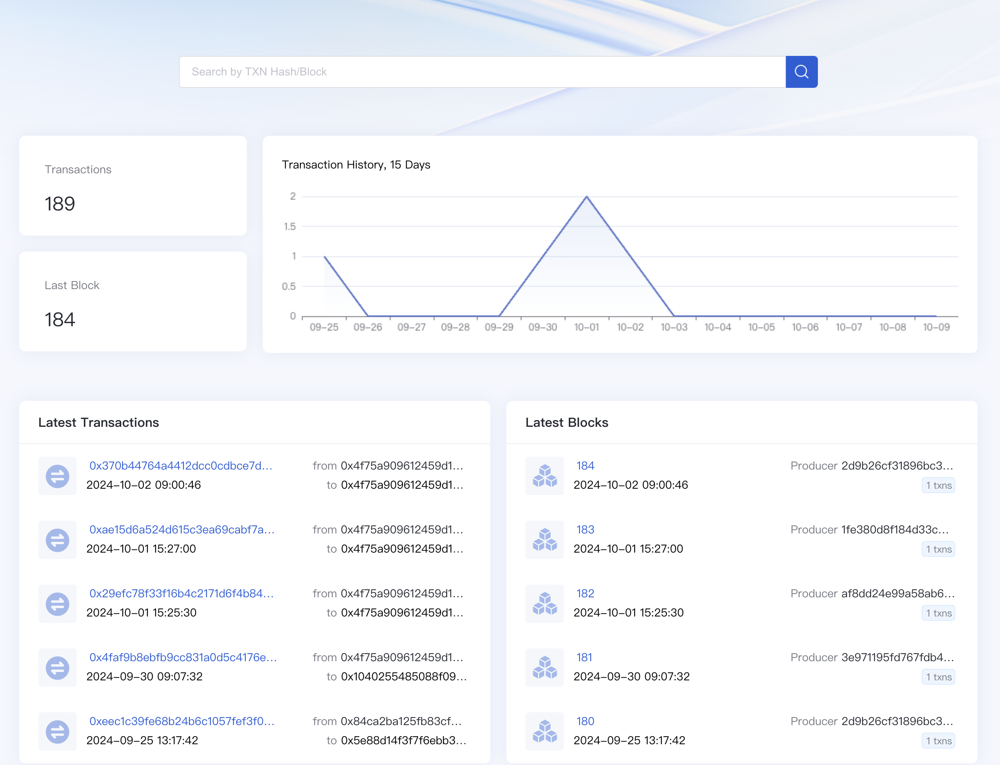
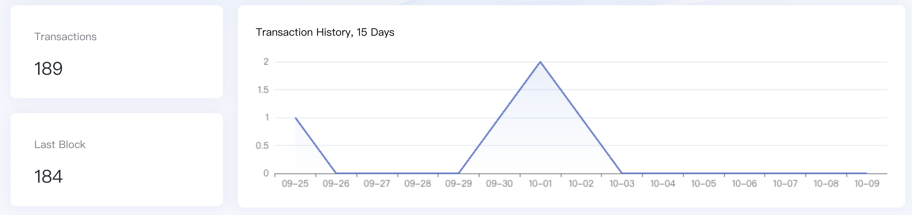
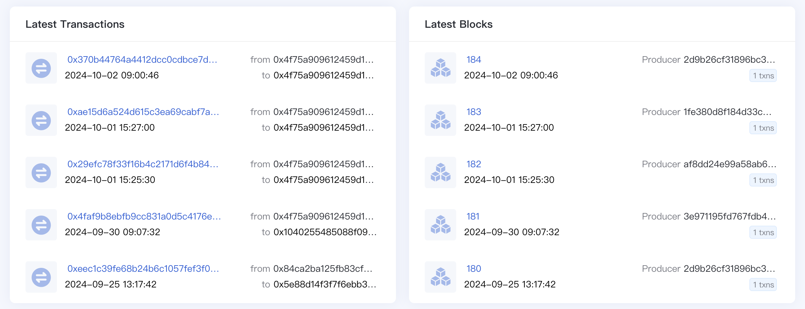
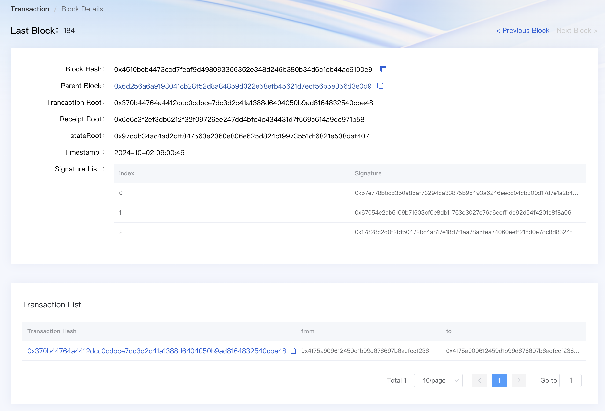
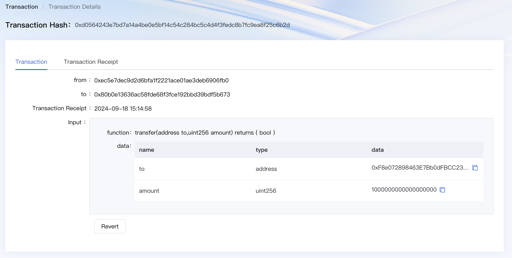
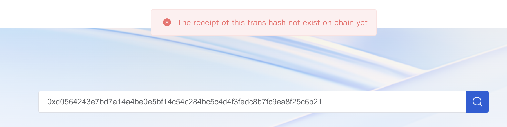

# WeCoScan usage

WeCoScan is a blockchain explorer for the Universal BCOS's public testnet POTOS. WeCoScan gives you an insight about the POTOS network by monitoring the network health and providing various statistics of POTOS network. You can also explore the block and transaction data and the list of smart contracts on the POTOS network.

Visit https://scan-testnet.eightart.hk/weco/#/chain to explore more.

## Major Features

Please note that some of the features are under development.

* Overview of the network
* Block search
* Transaction search
* Block proposer information

In the subsequent sections, we will visit the major functions and screenshots of WeCoScan.

## Dashboard

Network information is presented in the dashboard. The information includes transaction amount, last block committed, and the latest trends in transactions.

* Transactions: Totoal transactions amount in POTOS testnet.
* Last Block: The latest block height. It shows that how many blocks have been generated since the genesis.
* Transaction History: The graphs show the number of daily transactions over the last 14 days. You can see the trend in the transaction volume over the last two weeks.

## Recent Blocks & Transactions

These lists show recently created blocks and transactions respectively.

## Block detail

Overall information about the block.

* Block Hash: The unique identifier of the block. By pressing the copy button, you can easily copy the hash.
* Parent Hash: The unique identifier of the previous block. Clicking on the hash takes you to the detail view of the parent hash.
* Transaction Root: The root hash of the transaction trie.
* State Root: The root hash of the state trie.
* Receipt Root: The root hash of the receipt trie.
* Time: Elapsed time since the block generation. Exact datetime is also displayed next to it.
* Signature List: The list of signatures of validators who validated the block.
* Transactions List: The list of transactions included in the block.

## Transaction detail

Overall information about the transaction.

* From -&gt; To: The addresses of sender and receiver. By clicking the address, you can go to the detail view of the account. If a file icon displays next to the address, it means that address is contract.
* Time: Elapsed time since the transaction was executed.
* Input Data: Extra data provided by the sender or contract.

## Search

Through WeCoScan, you can search for the information about transactions and blocks. Entering a valid keyword will take you to the detail view of the entity.

Searchable keywords are hash of block and transaction, and only supported in the following formats:

* 66 characters long
* Starts with a prefix `0x`
* Hexadecimal number only \[0~9, a~f\]

If you search for a keyword that doesn't fit in the specified format or information hasn't yet been generated, no result page will appear.

