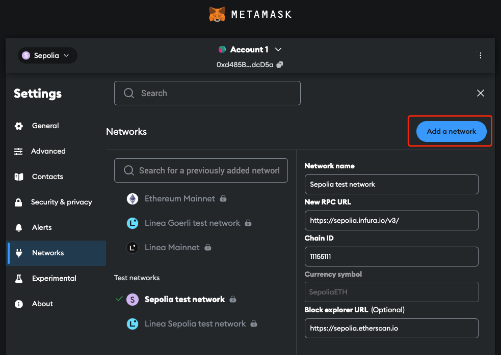
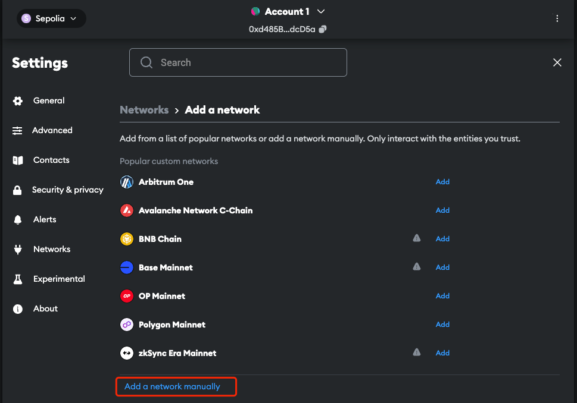
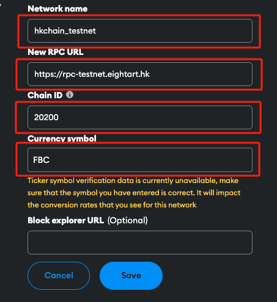
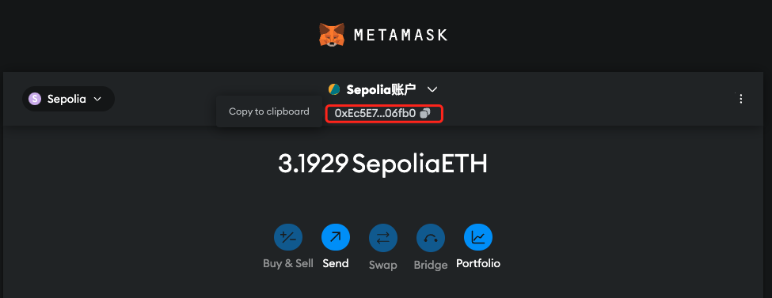
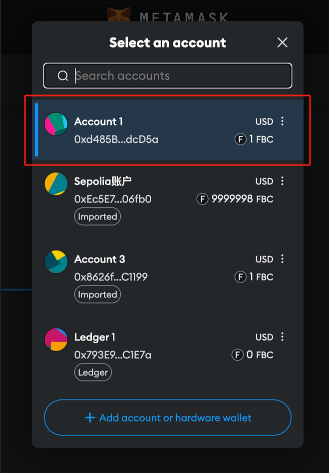
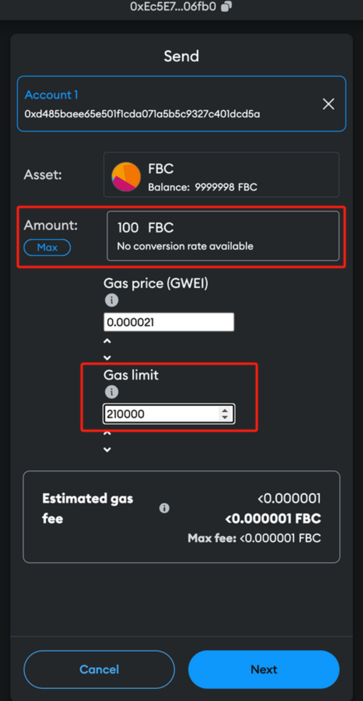
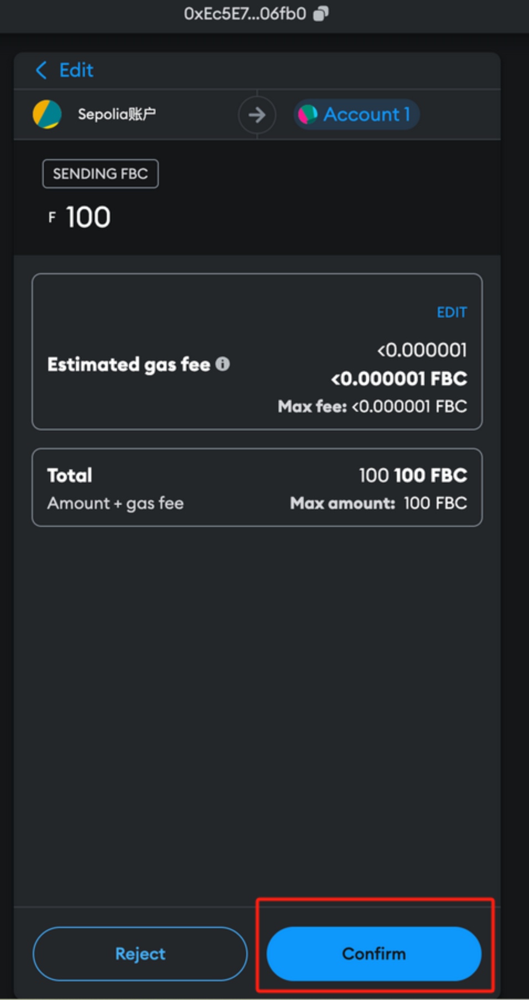
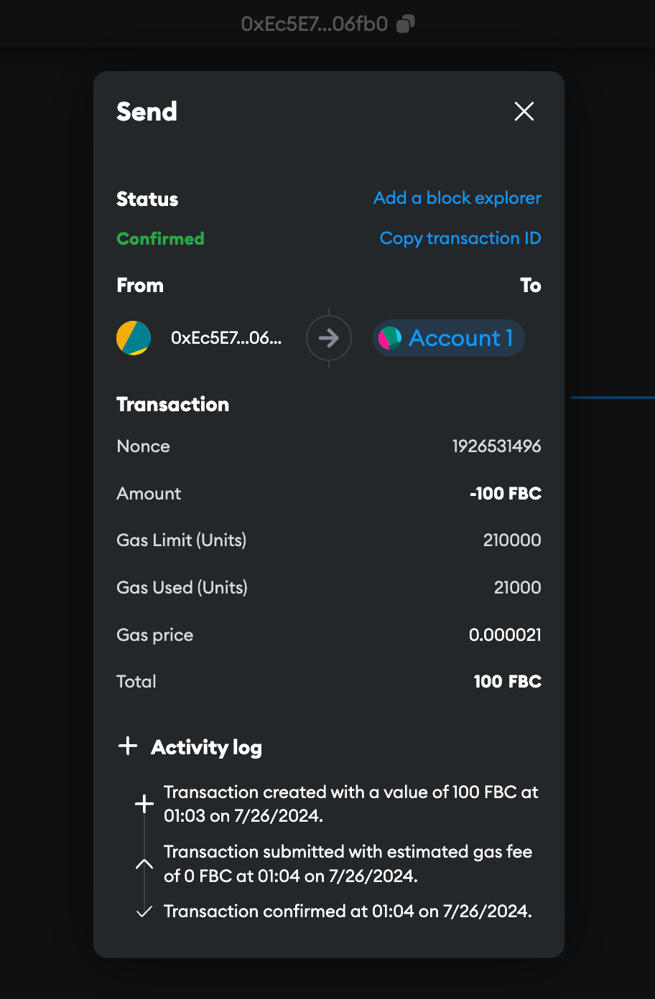
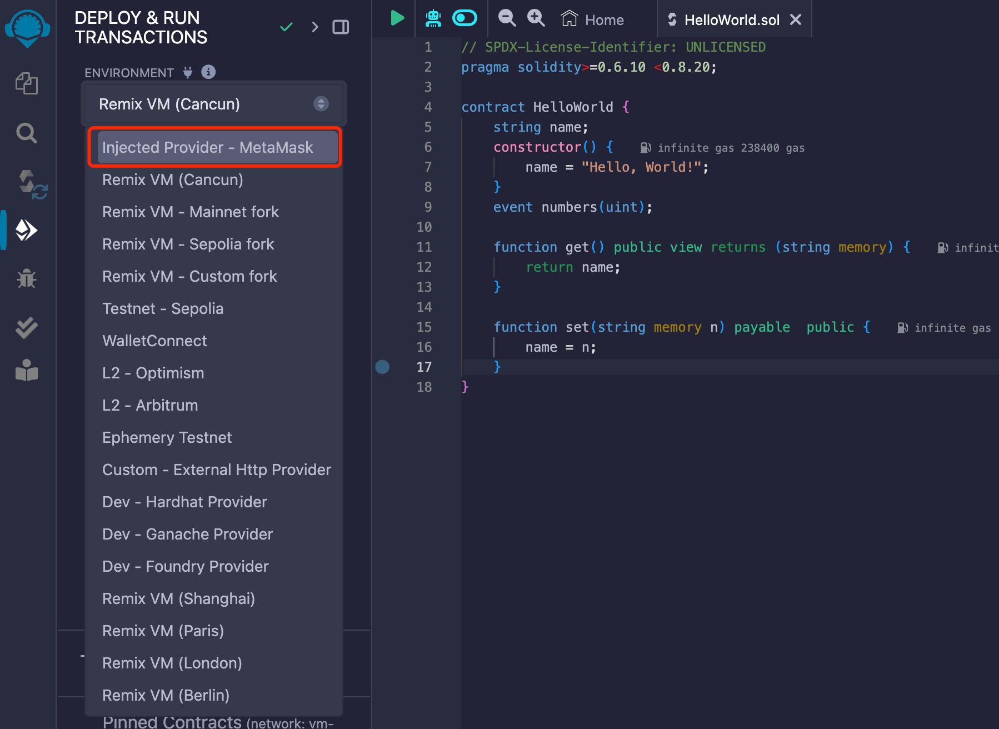

# Connecting MetaMask to UBCOS

Currently, Universal BCOS has a public testnet called POTOS, and this section will provide an example of connecting to POTOS using MetaMask.

If you wanna connecting your local UBCOS private chain with MetaMask, change RPC URL to http://127.0.0.1:8545 and continue follow steps. Deploy local UBCOS private chain you can check [here](../develop/deploy_guide.md).

## 1. Create A Wallet

If you do not have a wallet yet, create an account using MetaMask (choose any Ethereum-compatible account type) [here](https://metamask.io/download/). For more information on MetaMask, please refer [here](https://docs.metamask.io/).

## 2. Connect MetaMask to the Testnet

To access the Testnet, follow steps below to configure MetaMask:

- Open the “Network” setting, click “Add a network”:

    

- Click “Add a network manually”:

    

- Fill in required information for the Testnet and click “Save”:

    

- You will see the Testnet network added to the list.

## 3. Receive Testnet Tokens

Supply your wallet address [here](https://docs.eightart.hk/en/develop/dev_guide/testnet_guide.html#faucet_site.com) to get free Testnet faucet funds.

Testnet tokens are crypto assets created on a parallel test network to the Mainnet. Developers use the Testnet to test smart contracts and transactions without risking real-world implications on the Mainnet.

These Testnet tokens work like Mainnet coins, covering gas fees during testing. However, as they are issued in the parallel environment, Testnet tokens have no real-world value on the Mainnet.

You may find your wallet address here:

## 4. Trading with MetaMask Wallet

Once balance is updated, you can start trading on the Testnet.

- To transfer tokens to another wallet address, make sure that you set a gas limit >= 210,000 WEI.

- Confirm the transaction:

- Details will be displayed confirmation:

## Explorer

Check activities taking place on the Testnet [here](https://scan-testnet.eightart.hk/weco).

## Interact with Remix

Configure environment information in Deployment & Run Transactions tab [here](https://remix.ethereum.org/).

Select `Injected Provider - MetaMask` for `Environment`:

When initiating a deployment or calling on a contract, Remix will send the contract content to MetaMask. You will need to confirm transaction on MetaMask.

Find more information on Remix Online IDE [here](https://remix-ide.readthedocs.io/en/latest/).
